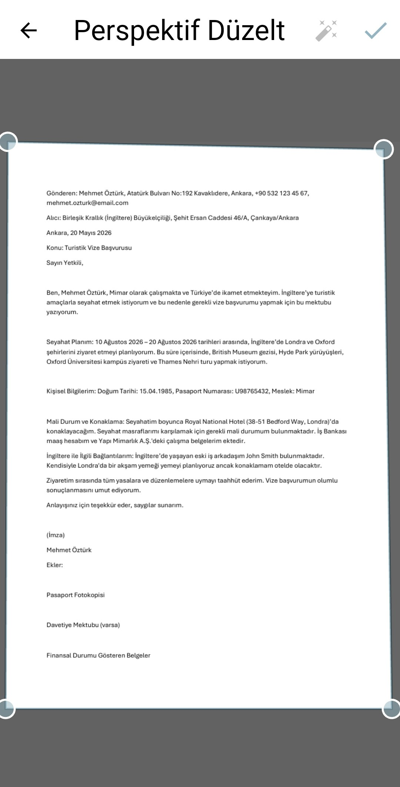
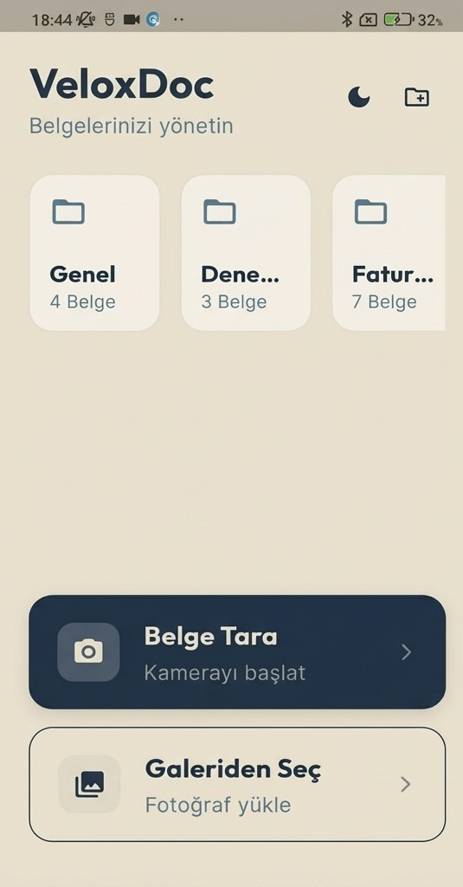
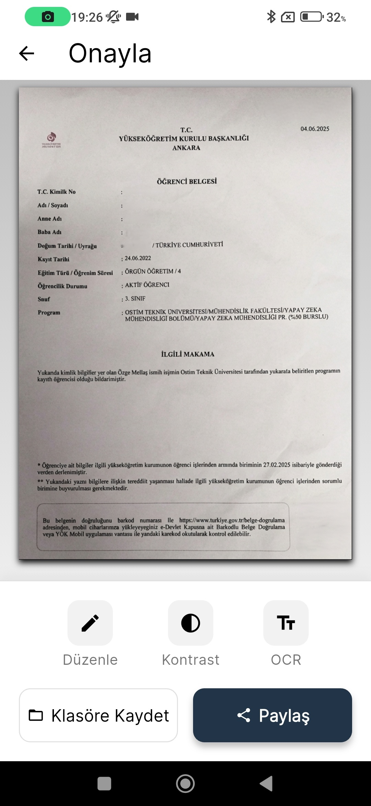
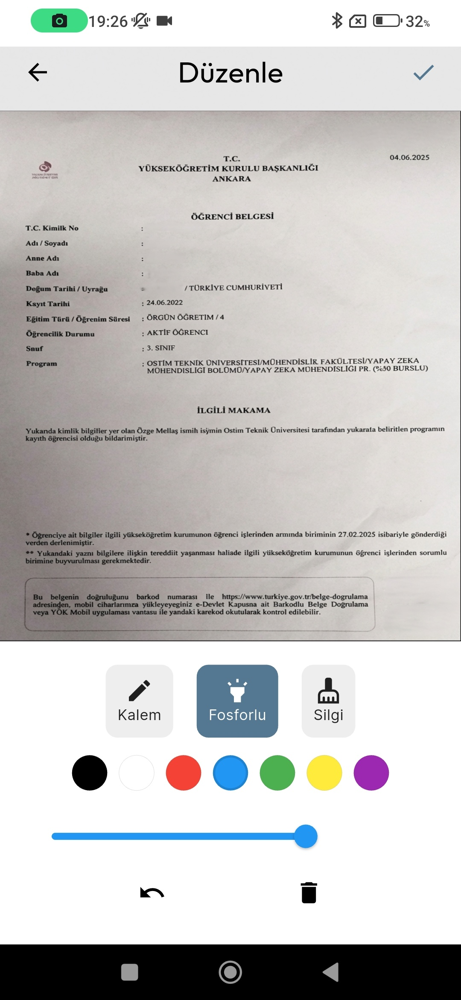

# VeloxDoc

VeloxDoc, modern ve güçlü bir mobil belge tarama uygulamasıdır. Flutter ile geliştirilmiştir.

## Özellikler
- 📄 Hızlı ve kaliteli belge tarama
- 🖊️ Belge düzenleme ve imzalama
- 📂 Kolay PDF dışa aktarma ve paylaşma
- 🤖 Akıllı görüntü işleme

## Ekran Görüntüleri

  
  
  
  
  

## Başlangıç

Bu proje Flutter kullanılarak geliştirilmiştir.

- [Flutter Dökümantasyonu](https://docs.flutter.dev/)

