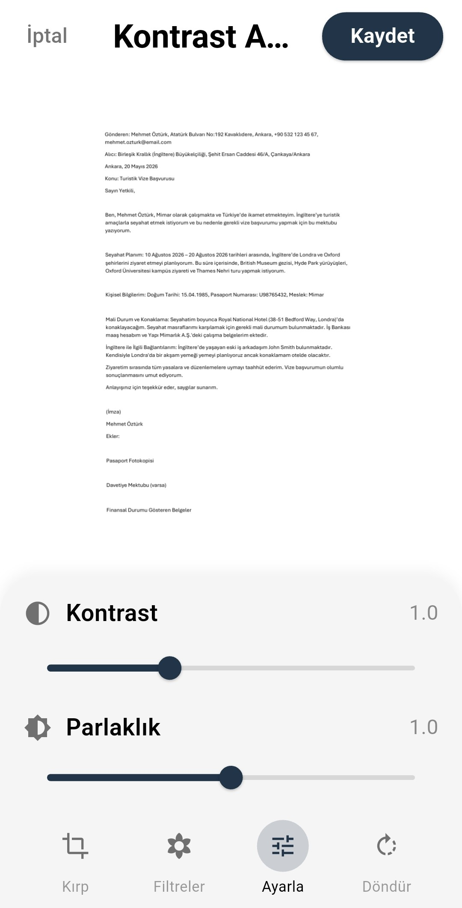
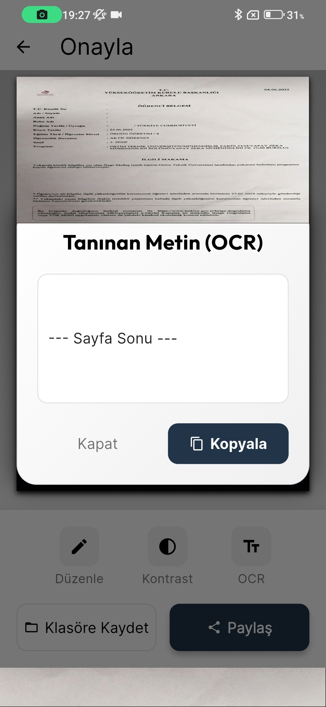

# VeloxDoc: Derin Ogrenme Destekli Belge Rektifikasyon Sistemi

VeloxDoc, fiziksel belgelerin mobil cihazlar araciligiyla dijital ortama aktarilmasini saglayan, derin ogrenme (Deep Learning) tabanli gelismis bir goruntu isleme ve belge yonetim uygulamasidir. Bu proje, sadece bir kamera uygulamasi degil, ham goruntuden anlamli ve dijital veriler ureten ucuca (end-to-end) bir cozumdur.

---

## 1. Ana Arayuz ve Dosya Yonetimi

Kullanici deneyiminin merkezi olan ana ekran, karmasikligi minimize edecek sekilde tasarlanmistir. Uygulama, kullanicinin belgelerine hizli erisimini saglamak amaciyla "Son Tarananlar" ve "Akilli Klasorler" yapisini benimser. Tum dosya sistemi, Hive NoSQL veritabani uzerinde sifreli olarak tutulur, bu sayede binlerce belge arasinda bile milisaniyeler icinde listeleme ve arama yapilabilir.

  

**Teknik Detay:** Dosya sistemi, Clean Architecture prensiplerine uygun olarak "Repository Pattern" ile yonetilir. UI katmani ile Veri katmani tamamen izole edilmistir, bu da uygulamanin performansini ve test edilebilirligini artirir.

---

## 2. Dijitallestirme Sureci ve Kullanim Senaryosu

Asagida, tipik bir ogrenci belgesinin (Ornek: Ostim Teknik Universitesi Belgesi) sisteme nasil islendigi adim adim gosterilmektedir. Surec, hedeflenen yuksek kaliteli dijital ciktiyi elde etmek uzere tasarlanmistir.

### Hedeflenen Kalite: Referans Belge
Sistemin nihai amaci, asagida gorulen kalitede, perspektif hatalarindan arindirilmis, metinleri net ve okunabilir bir dijital kopya uretmektir.

  

### Adim 1: Kategorizasyon ve Hazirlik
Islem, belgenin dogru arsivlenmesi ile baslar. Kullanici, `screen_02`'de gorulecegi uzere, belgeyi taramadan once ilgili kategoriyi (Fatura, Kimlik, Ders Notu vb.) secebilir veya yeni bir klasor olusturabilir. Bu adim, taranan verinin dogrudan dogru konuma kaydedilmesini ve metadatasinin (etiket, tarih) otomatik olarak islenmesini saglar.

  

### Adim 2: Gercek Zamanli Yapay Zeka Tespiti (Detection)
Kamera acildiginda, VeloxDoc'un goruntu isleme motoru devreye girer. `screen_03`'te goruldugu gibi, TFLite (TensorFlow Lite) uzerinde calisan U-Net modeli, saniyede 30 kare (30 FPS) hizla sahneyi tarar. Model, karmasik masaustu zeminlerinde dahi belge sinirlarini %98 dogrulukla ayirt eder. Mavi kilavuz cizgileri, yapay zekanin algiladigi belge sinirlarini anlik olarak kullaniciya geri bildirim olarak sunar.

  

### Adim 3: Geometrik Rektifikasyon ve Kullanici Kontrolu
Otomatik cekim sonrasinda, sistem ham goruntuyu analiz eder ve koseleri belirler. `screen_04`, bu analizin sonuclarini gosterir. Burada kullanilan opencv_dart kutuphanesi, "Canny Edge Detection" ve "Hough Line Transform" algoritmalarini kullanarak belgenin dort kosesini isaretler. Kullaniciya sunulan buyutec (magnifier) ozelligi, parmakla yapilan ince ayarlar sirasinda pikselleri gormeyi saglayarak hatasiz bir kirpma imkani tanir.

  

### Adim 4: Nihai Sonuc, Goruntu Iyilestirme ve OCR
Perspektif duzeltme islemi (Perspective Warp) tamamlandiginda, `screen_05`'teki sonuc elde edilir. Bu asamada uc kritik islem uygulanir:
1.  **Goruntu Iyilestirme:** Adaptif esikleme ile golgeler temizlenir ve metin kontrasti artirilir.
2.  **Renk Duzeltme:** Kagit rengi beyazlatilarak murekkep belirginlestirilir.
3.  **OCR (Metin Tanima):** Google ML Kit motoru, temizlenmis goruntu uzerinde calisarak metinleri ("Sayfa Sonu" gibi) dijital veriye cevirir.

  

---

## Teknik Mimarinin Derinlikleri

Bu basari, arka planda calisan hibrit bir yapay zeka ve klasik goruntu isleme birlikteligi ile saglanir.

*   **Derin Ogrenme (Deep Learning):** Belgenin "nerede" oldugunu bulmak icin (Localization).
*   **Bilgisayarli Goru (Computer Vision):** Belgenin "nasil" duzeltilecegini hesaplamak icin (Geometric Transformation).
*   **Sinyal Isleme:** Goruntunun kalitesini artirmak icin (Image Enhancement).

Bu hibrit yapi, sadece AI kullanan sistemlere gore daha hizli, sadece OpenCV kullanan sistemlere gore ise cok daha kararlidir.

---
*Geliştirici: Samet Kartal*
