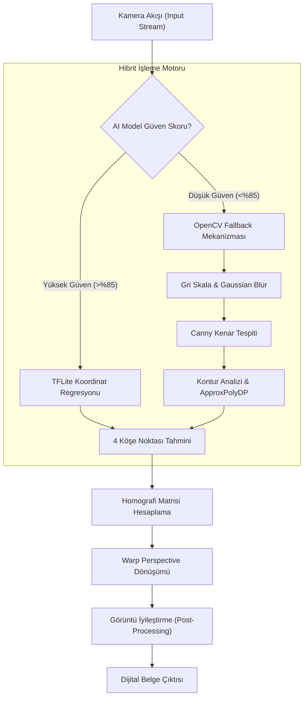
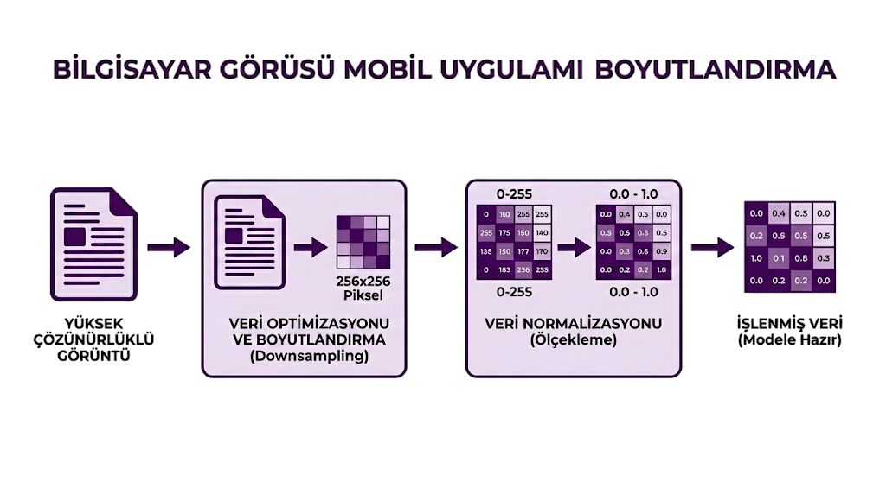
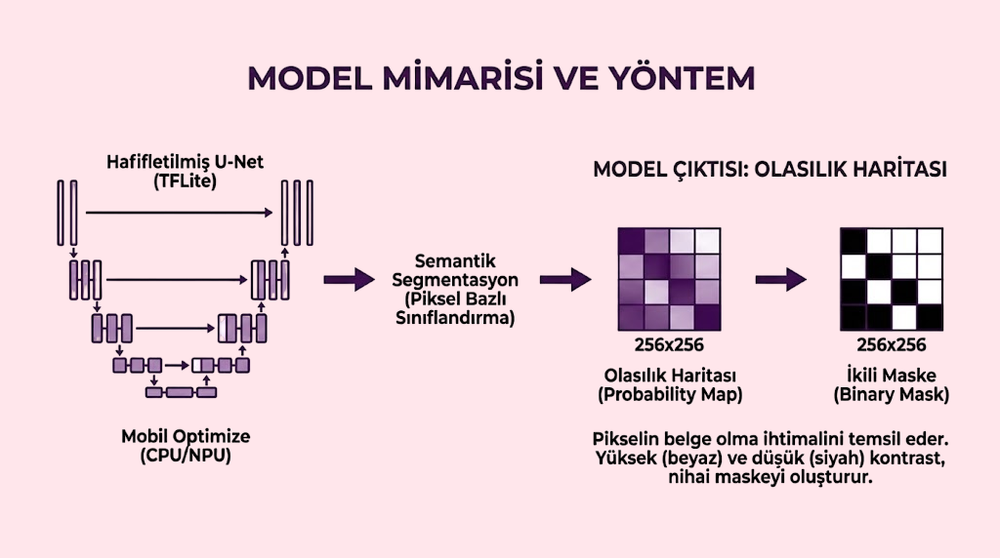
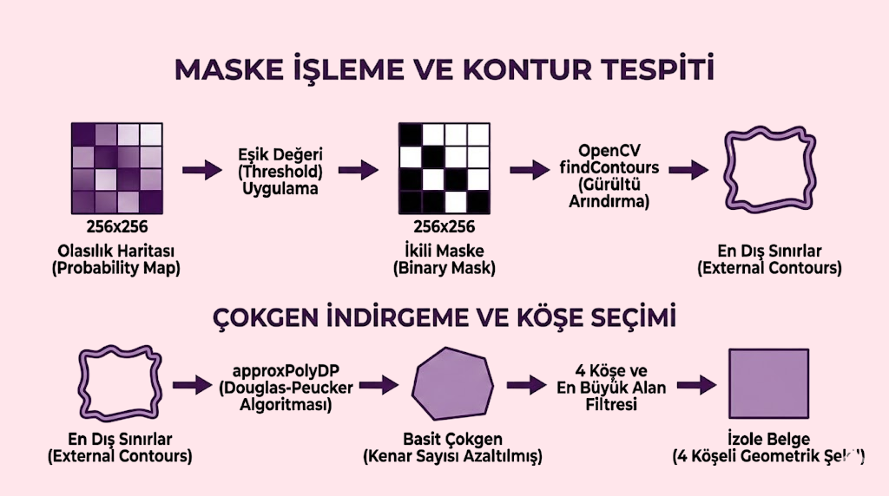
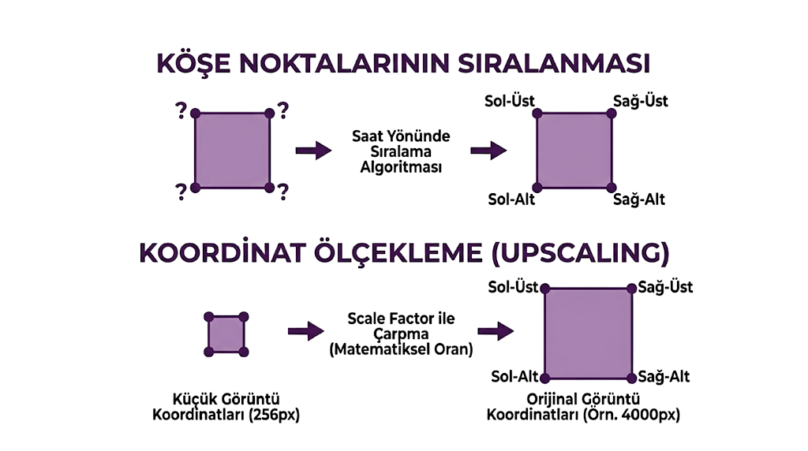
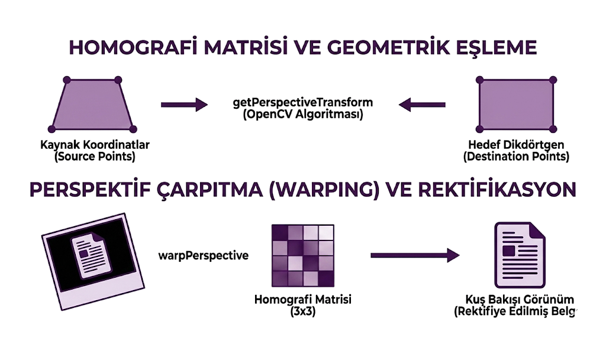
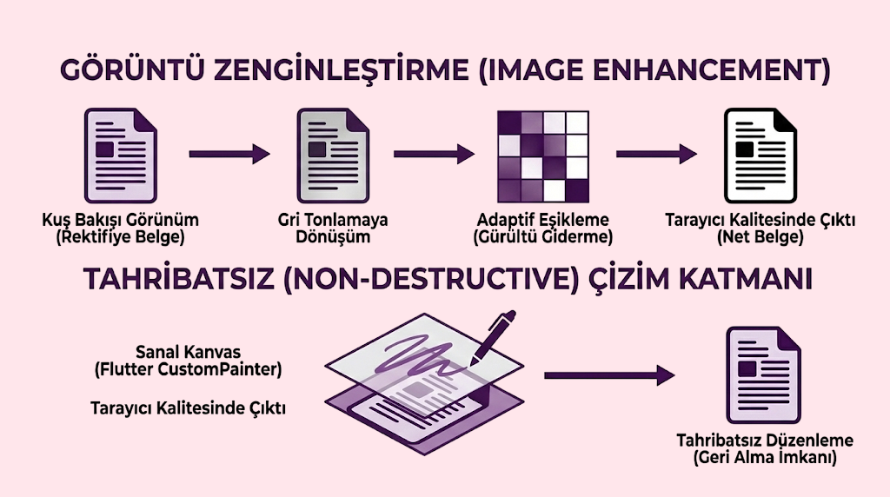

# VeloxDoc: Hibrit Görüntü İşleme ve Dijital Arşivleme Sistemi

<div align="center">


</div>

**VeloxDoc**, fiziksel belgelerin mobil cihazlar aracılığıyla dijital ortama aktarılmasını sağlayan, uçtan uca (end-to-end) bir görüntü işleme ve dijital arşivleme çözümüdür. Sıradan kamera uygulamalarından farklı olarak, ham görüntü verisini anlamlandırmak ve geometrik bozuklukları gidermek için **Derin Öğrenme (Deep Learning - TFLite)** ve **Bilgisayarlı Görü (OpenCV)** disiplinlerini hibrit bir mimaride birleştirir.

Tüm işlem hattı (Image Processing Pipeline) cihaz üzerinde (on-device) ve internet bağlantısız çalışacak şekilde optimize edilmiştir.

---

## 🚀 Temel Özellikler

| Özellik | Açıklama | Teknoloji Yığını |
| :--- | :--- | :--- |
| **Hibrit Kenar Tespiti** | Dayanıklılık ve hız için yapay zeka (TFLite) ve Klasik CV (OpenCV) arasında dinamik geçiş yapar. | `tflite_flutter`, `opencv_dart` |
| **Perspektif Düzeltme** | Homografi matrisi kullanarak perspektif bozulmalarını (Keystone Effect) otomatik olarak düzeltir. | `Lineer Cebir` |
| **Güvenli Kasa** | Belgeler, AES-256 şifrelemeli yerel bir Hive veritabanında saklanır. | `hive`, `aes_256` |
| **Çevrimdışı Yapı** | Sıfır sunucu bağımlılığı. Tam veri gizliliği için tüm işlemler cihazda gerçekleşir. | `Offline-First` |
| **Akıllı Filtreler** | Görüntü zenginleştirme için uyarlanabilir eşikleme (Adaptive Thresholding) ve siyah-beyaz (Binarization) filtreleri. | `image_editor` |

---

## 🏗️ Proje Mimarisi

VeloxDoc, sürdürülebilirlik ve test edilebilirlik için **Clean Architecture** prensiplerine sıkı sıkıya bağlıdır.

```plaintext
lib/
├── main.dart                 # Uygulama giriş noktası ve bağımlılık enjeksiyonu
├── models/                   # Veri modelleri (Hive Entityleri)
│   ├── document_model.dart   # Taranan belge varlığı
│   ├── folder_model.dart     # Klasörleme yapısı
│   └── theme_manager.dart    # Tema yönetimi state'i
├── screens/                  # UI Katmanı (Flutter Widgetları)
│   ├── dashboard.dart        # Ana kontrol paneli
│   ├── camera_screen.dart    # Canlı kamera ve AI overlay
│   ├── edit_screen.dart      # Kırpma ve düzenleme ekranı
│   └── ...
├── services/                 # İş Mantığı ve Harici Servisler
│   ├── camera_service.dart   # Kamera donanım kontrolü
│   ├── tflite_service.dart   # AI model çıkarımı (Inference)
│   └── hive_service.dart     # Veritabanı işlemleri
└── utils/                    # Yardımcı Fonksiyonlar
    ├── image_utils.dart      # Piksel manipülasyonu
    └── math_utils.dart       # Geometrik hesaplamalar
```

---

## 🧠 Teknik Mimari ve Algoritmik Akış

Sistemin kalbi, milisaniyeler içinde çalışan üç aşamalı bir görüntü işleme motorudur.

### Görüntü İşleme Pipeline'ı (Mermaid Diyagramı)



### Algoritmik Detaylar & Karşılaştırma

Neden tek bir yöntem yerine hibrit bir yapı kullanıldı?

| Yöntem | Avantajlar | Dezavantajlar | VeloxDoc Kullanımı |
| :--- | :--- | :--- | :--- |
| **Semantik Segmentasyon (U-Net)** | Çok yüksek doğruluk, piksel seviyesinde hassasiyet. | Yavaş (~5-10 FPS), yüksek işlemci gücü gerektirir. | ❌ Kullanılmadı (Mobil için ağır). |
| **Koordinat Regresyonu (MobileNet)** | **Çok Hızlı (30+ FPS)**, düşük gecikme. | Karmaşık arka planlarda bazen kararsız olabilir. | ✅ **Birincil Yöntem.** |
| **Klasik CV (Canny/Hough)** | Düz, kontrastlı zeminlerde mükemmel matematiksel kesinlik. | Gölge ve gürültüden çok etkilenir. | ✅ **Yedek (Fallback) Sistem.** |

---

### Görsel Pipeline Analizi

### Görsel Pipeline Analizi
VeloxDoc motorunun bir belge karesini işlerken izlediği adımlar ve teknik detaylar:

<table>
  <tr>
    <td width="50%" valign="top">
        <h4 align="center">ADIM 1: Optimizasyon ve Giriş</h4>
        
        <br>
        <p><strong>Veri Optimizasyonu ve Boyutlandırma:</strong> Mobil cihazlardan alınan yüksek çözünürlüklü kamera verilerinin doğrudan sinir ağlarına beslenmesi, yüksek işlem maliyeti ve gecikmeye (latency) neden olur. Bu darboğazı aşmak ve gerçek zamanlı işlem performansı sağlamak amacıyla, giriş görüntüsü modelin mimari gereksinimi olan 256x256 piksel boyutuna indirgenir (Downsampling).</p>
        <p><strong>Veri Normalizasyonu:</strong> Modelin matematiksel yakınsamasını (convergence) hızlandırmak ve aydınlatma farklarından kaynaklanan varyasyonları minimize etmek amacıyla piksel değerlerine normalizasyon uygulanır. RGB kanallarındaki yoğunluk değerleri, standart 0-255 tamsayı aralığından 0.0 - 1.0 kayan noktalı sayı (floating point) aralığına ölçeklenerek modelin kararlılığı artırılır.</p>
    </td>
    <td width="50%" valign="top">
        <h4 align="center">ADIM 2: Model Tahmini</h4>
        
        <br>
        <p><strong>Model Mimarisi ve Yöntem:</strong> Belge sınırlarının tespiti için mobil işlemcilerde (CPU/NPU) düşük gecikmeyle çalışmak üzere optimize edilmiş, hafifletilmiş bir U-Net (TFLite) mimarisi kullanılmaktadır. Klasik nesne tespitinden (bounding box) farklı olarak Semantik Segmentasyon yöntemi uygulanır; bu sayede görüntü piksel bazında sınıflandırılarak (pixel-wise classification) en hassas geometrik sınırlar elde edilir.</p>
        <p><strong>Model Çıktısı (Olasılık Haritası):</strong> Modelin çıktısı, giriş görüntüsüyle (256x256) aynı uzamsal boyuta sahip bir Olasılık Haritası (Probability Map)'dır. Matris üzerindeki her bir değer, ilgili pikselin "belge" olma ihtimalini temsil eder. Yüksek olasılıklı pikseller (beyaz) ile düşük olasılıklı pikseller (siyah) arasındaki kontrast, nihai İkili Maskeyi (Binary Mask) oluşturur.</p>
    </td>
  </tr>
  <tr>
    <td width="50%" valign="top">
        <h4 align="center">ADIM 3: Maske ve Kontur</h4>
        
        <br>
        <p><strong>Maske İşleme ve Kontur Tespiti:</strong> AI modelinden elde edilen olasılık haritası, bir eşik değeri (threshold) uygulanarak kesin bir ikili maskeye (binary mask) dönüştürülür. Bu maske üzerinde OpenCV kütüphanesinin topolojik yapı analizi algoritmaları (findContours) kullanılarak, gürültüden arındırılmış en dış nesne sınırları (external contours) tespit edilir.</p>
        <p><strong>Çokgen İndirgeme ve Köşe Seçimi:</strong> Tespit edilen ham konturlar genellikle pürüzlü kenarlara sahiptir. Douglas-Peucker algoritmasını kullanan <code>approxPolyDP</code> fonksiyonu ile bu karmaşık şekiller, kenar sayısı azaltılarak daha basit çokgenlere indirgenir. Algoritma, filtreleme kriteri olarak alanı en büyük olan ve tam olarak 4 köşe noktasına sahip geometrik şekli "belge" olarak izole eder.</p>
    </td>
    <td width="50%" valign="top">
        <h4 align="center">ADIM 4: Koordinat İşleme</h4>
        
        <br>
        <p><strong>Köşe Noktalarının Sıralanması:</strong> Yapay zeka 4 köşe noktasını bulur ancak bunların hangisinin "Sol-Üst" veya "Sağ-Alt" olduğunu bilmez. Perspektif düzeltmenin hatasız çalışması için, bu noktalar bir algoritma yardımıyla saat yönüne (Sol-Üst'ten başlayarak) doğru sıraya dizilir.</p>
        <p><strong>Koordinat Ölçekleme (Upscaling):</strong> Hız kazanmak için tespit işlemini küçük (256 piksel) görüntüde yaptık. Ancak net bir çıktı almak için bu noktaları orijinal, büyük fotoğrafa (örn. 4000 piksel) uyarlamamız gerekir. Bulunan koordinatlar, basit bir matematiksel oranla (Scale Factor) çarpılarak orijinal görüntü üzerindeki gerçek yerlerine taşınır.</p>
    </td>
  </tr>
  <tr>
    <td width="50%" valign="top">
        <h4 align="center">ADIM 5: Homografi Hesabı</h4>
        
        <br>
        <p><strong>Homografi Matrisi ve Geometrik Eşleme:</strong> Yamuk perspektife sahip belgeyi düz bir düzleme oturtmak için, kaynak görüntüdeki koordinatlar (Source Points) ile hedeflenen ideal dikdörtgen (Destination Points) arasında matematiksel bir ilişki kurulmalıdır. OpenCV’nin <code>getPerspectiveTransform</code> algoritması, bu iki düzlem arasındaki geçişi sağlayan ve geometrik dönüşümü tanımlayan 3x3’lük Homografi Matrisini hesaplar.</p>
    </td>
    <td width="50%" valign="top">
        <h4 align="center">ADIM 6: Perspektif Düzeltme</h4>
        
        <br>
        <p><strong>Perspektif Çarpıtma (Warping) ve Rektifikasyon:</strong> Hesaplanan matris, <code>warpPerspective</code> fonksiyonu aracılığıyla görüntüye uygulanır. Bu işlem görüntüyü sadece döndürmez; pikselleri uzayda bükerek (warping) perspektif kaçış noktalarını düzeltir. Sonuç olarak, açılı ve derinlikli çekilmiş fotoğraf, geometrik hatalardan arındırılarak sanki tam tepeden taranmış gibi kuş bakışı (bird's-eye view) bir forma kavuşturulur.</p>
    </td>
  </tr>
</table>

---

## 📸 Uygulama Akışı (Visual Workflow)

<table>
  <tr>
    <td align="center" width="33%">
        <h3>1. Dashboard & Kasa</h3>
        
        <br><br>
        <p><em><strong>Merkezi Doküman Yönetimi:</strong> Özelleştirilebilir kategoriler (Fatura, Sözleşme vb.) ve akıllı dosyalama sistemi ile dijital arşivinize bütünleşik bir bakış sunan ana yönetim paneli.</em></p>
    </td>
    <td align="center" width="33%">
        <h3>2. Rektifikasyon</h3>
        
        <br><br>
        <p><em><strong>Hassas Geometrik Düzeltme:</strong> Yapay zeka tabanlı köşe tespit algoritmasının sonuçlarını denetleyebileceğiniz, milimetrik hassasiyette (pixel-perfect) kırpma ve perspektif ayarlama arayüzü.</em></p>
    </td>
    <td align="center" width="33%">
        <h3>3. Meta Veri & Kayıt</h3>
        
        <br><br>
        <p><em><strong>Gelişmiş Editör ve OCR:</strong> Görüntü işleme, metin tanıma (OCR) ve format dönüştürme gibi post-prodüksiyon araçlarının yönetildiği, belgenin dijitalleşme sürecindeki komuta merkezi.</em></p>
    </td>
  </tr>
  <tr>
    <td align="center">
        <h3>4. Akıllı Tarama</h3>
        
        <br><br>
        <p><em><strong>Dijital Not ve İşaretleme:</strong> Belge üzerinde interaktif düzenleme imkanı sunan; sanal kalem, silgi ve vurgulayıcı (highlighter) gibi zengin araç setine sahip çizim modülü.</em></p>
    </td>
    <td align="center">
        <h3>5. Manuel Hassas Ayar</h3>
        
        <br><br>
        <p><em><strong>Görüntü Zenginleştirme:</strong> Sepya, Gri Tonlama ve Negatif gibi filtrelerin yanı sıra; parlaklık ve kontrast dengesini optimize ederek belge okunabilirliğini maksimize eden ayar paneli.</em></p>
    </td>
    <td align="center">
        <h3>6. Final Sonuç</h3>
        
        <br><br>
        <p><em><strong>Yüksek Kaliteli Çıktı:</strong> Optik Karakter Tanıma (OCR) işlemi tamamlanmış, yüksek çözünürlüklü ve anlık paylaşıma hazır profesyonel dijital belge çıktısı.</em></p>
    </td>
  </tr>
</table>

---

## 🛠️ Kurulum ve Çalıştırma (Installation)

### Gereksinimler (Prerequisites)
- **Flutter SDK:** >=3.2.3 <4.0.0
- **Dart SDK:** >=3.2.0
- **Android Studio / VS Code** (Flutter eklentileri ile)
- **Android SDK:** Min SDK 21 (Android 5.0 Lollipop)

### 1. Projeyi Klonlayın
```bash
git clone https://github.com/samettkartal/veloxdoc.git
cd veloxdoc
```

### 2. Bağımlılıkları Yükleyin
```bash
flutter pub get
```

### 3. Model Dosyalarını Kontrol Edin
AI modelinin `assets/` klasöründe bulunduğundan emin olun:
```bash
/assets
  ├── scan_model_pro.tflite  # Koordinat regresyon modeli
  └── ...
```

### 4. Uygulamayı Başlatın
```bash
# Debug modunda çalıştırmak için:
flutter run

# Release (Performans) modunda test etmek için:
flutter run --release
```

---

## 📄 Lisans
Bu proje MIT Lisansı altında lisanslanmıştır. Detaylar için [LICENSE](LICENSE) dosyasına bakınız.

---
**Geliştirici:** Samet Kartal
