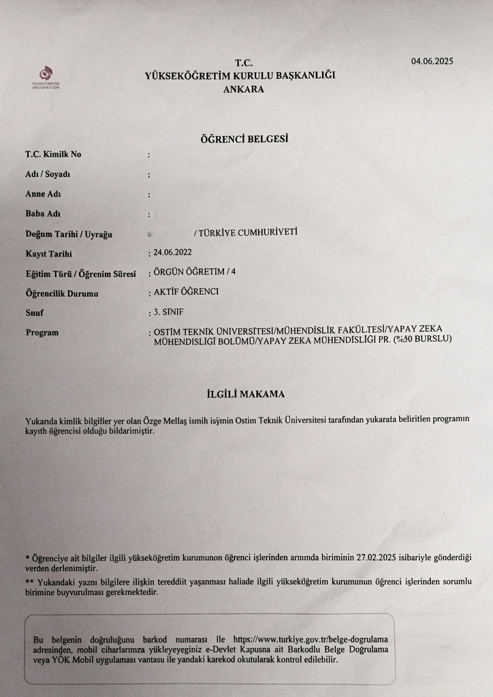

# VeloxDoc: Hibrit Goruntu Isleme ve Dijital Arsivleme Sistemi

VeloxDoc, fiziksel belgelerin mobil cihazlar aracılığıyla dijital ortama aktarılmasını sağlayan, uçtan uca (end-to-end) bir görüntü işleme ve dijital arşivleme çözümüdür. Sıradan kamera uygulamalarından farklı olarak, ham görüntü verisini anlamlandırmak ve geometrik bozuklukları gidermek için **Derin Öğrenme (Deep Learning - TFLite)** ve **Bilgisayarlı Görü (OpenCV)** disiplinlerini hibrit bir mimaride birleştirir.

## Teknik Mimari ve Algoritmik Altyapı

### 1. Sistem Mimarisi (Clean Architecture & Hive)
Proje, modern mobil geliştirme standartlarına uygun olarak **Clean Architecture** prensipleriyle tasarlanmıştır. İş mantığı (Business Logic), veri katmanı (Data Layer) ve kullanıcı arayüzü (Presentation Layer) tam izolasyon içindedir.
Veri kalıcılığı için cihaz üzerinde çalışan, yüksek performanslı ve şifrelenebilir (AES-256) **Hive NoSQL** veritabanı kullanılmıştır. Bu yapı, binlerce belgeyi milisaniyeler içinde indeksleyebilir ve sorgulayabilir. `FolderModel` yapısı sayesinde belgeler hiyerarşik olarak yönetilir.

### 2. Hibrit Görüntü İşleme Pipeline'ı
Sistemin çekirdeğinde, üç aşamalı bir görüntü işleme hattı bulunur:
1.  **AI Regresyon (Koordinat Tahmini):** Geleneksel segmentasyon (U-Net) modellerinin aksine, VeloxDoc hız odaklı bir **Coordinate Regression** modeli kullanır (`scan_model_pro.tflite`). Model, 224x224 boyutundaki girdiyi işler ve doğrudan belgenin 4 köşe noktasını (x,y) tahmin eder. Bu yöntem, piksel piksel tarama yapmadığı için mobil cihazlarda çok daha düşük gecikme (latency) ile çalışır.
2.  **Fallback Mekanizması (OpenCV):** Eğer AI modelinin güven skoru (confidence) düşükse, sistem otomatik olarak klasik Computer Vision yöntemlerine döner. Görüntü Gri Skalaya çevrilir, Gaussian Blur ile gürültüden arındırılır ve Canny Edge Detection ile kenarlar bulunur. `findContours` ve `approxPolyDP` algoritmalarıyla en büyük dörtgen geometrik olarak hesaplanır.
3.  **Geometrik Rektifikasyon (Warp Perspective):** Elde edilen 4 köşe noktası (Kaynak) ve hedeflenen çıktı boyutları (Hedef) kullanılarak 3x3'lük bir **Homografi Matrisi** hesaplanır. Görüntü bu matris ile yeniden haritalandırılarak (Remapping), açılı duran belge kuş bakışı formuna getirilir.

---

## Uygulama Görsel Akışı (Visual Workflow)

Aşağıda, bir belgenin sisteme girişinden dijital çıktıya dönüşmesine kadar geçen süreç adım adım gösterilmiştir.

### Girdi ve Arayüz

  
  
<em>Ana Kontrol Paneli ve Klasör Yapısı</em>

   
  
  
<em>İşlenecek Ham Belge Örneği</em>

### İşlem Adımları

  <h3>ADIM 1: Manuel Onay (Manual Adjustment)</h3>
  
  
<em>AI ve OpenCV tarafından bulunan köşelerin kullanıcı tarafından doğrulanması.</em>

   

  <h3>ADIM 2: Kategori Yönetimi</h3>
  
  
<em>Belgelerin sınıflandırılması ve meta veri yönetimi.</em>

   

  <h3>ADIM 3: AI İşleme (Regresyon)</h3>
  
  
<em>Arka planda çalışan TFLite modelinin belgeyi algıladığı an.</em>

   

  <h3>ADIM 4: Rektifikasyon ve Düzenleme</h3>
  
  
<em>Homografi matrisi ile düzleştirilmiş belge ve düzenleme araçları.</em>

   

  <h3>ADIM 5: Final Sonuç</h3>
  
  
<em>İyileştirilmiş kontrast ve OCR'a hazır dijital çıktı.</em>

---
*Geliştirici: Samet Kartal*
